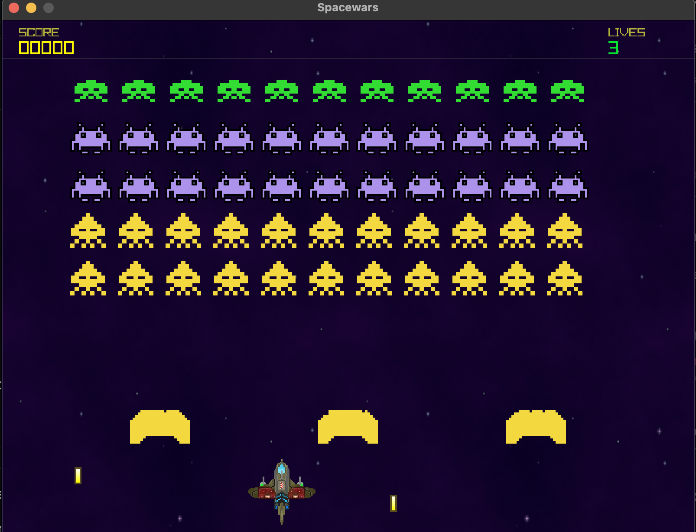

# Spacewars

<p align="center">
  
</p>

<p align="center">
  A compact, Space Invaders-inspired arcade shooter built in C++ with <a href="https://www.raylib.com/">raylib</a>.
</p>

## Overview

Defend the last line against a descending alien formation. Move through the
starfield, use the destructible shields for cover, and keep the score climbing
before the three available lives run out.

The game is a work in progress, but its core gameplay loop is complete: player
movement and firing, alien movement and return fire, collision handling,
destructible defenses, scoring, effects, respawning, and game restart.

## Features

- Classic left/right movement and a rate-limited laser.
- A formation of 55 aliens across three enemy types.
- Destructible shields that block both player and enemy fire.
- Progressive difficulty: the surviving aliens move and shoot faster.
- A 100-point mystery ship that crosses the top of the screen periodically.
- Three lives, a 3 second ship respawn delay, explosions, score UI, and a
  restart screen.
- Hand-authored texture background, and sound assets included in the repo.

## Controls

| Key | Action |
| --- | --- |
| `Left Arrow` | Move left |
| `Right Arrow` | Move right |
| `Space` | Fire |
| `Enter` | Restart after game over |

## Scoring

| Target | Points |
| --- | ---: |
| Squid | 30 |
| Crab | 20 |
| Octopus | 10 |
| Mystery ship | 100 |

## Build and run

### Prerequisites

- CMake 3.14 or newer
- A C++17-capable compiler
- Git and an internet connection for the first configure step: CMake fetches
  raylib 5.0 automatically

From the project root:

```bash
cmake -S . -B build
cmake --build build
./build/spacewars
```

Run the executable from the project root. The game loads its assets through
relative `assets/...` paths, so launching it from the build directory will not
find them.

On multi-configuration generators such as Visual Studio, build with:

```bash
cmake --build build --config Release
```

Then launch the generated executable while the working directory is this
repository's root.

## Project layout

```text
.
├── assets/
│   ├── misc/          # Gameplay capture
│   ├── sounds/        # WAV effects
│   └── texture/       # Sprites, explosion sheet, and background
├── src/
│   ├── main.cpp       # Window creation and frame loop
│   ├── game.*         # Game state, rules, collisions, UI, and difficulty
│   ├── spaceship.*    # Player movement, firing, and respawning
│   ├── alien.*        # Alien types, movement, and score values
│   ├── obstacle.*     # Destructible shield construction
│   ├── bullet.*       # Projectile movement and rendering
│   ├── mysteryship.*  # Periodic bonus target
│   ├── explosion.*    # Sprite-sheet explosion effect
│   └── audiomanager.* # Sound loading and playback
├── CMakeLists.txt
└── README.md
```

## Technical notes

Spacewars targets a fixed 800 × 600 window at 60 FPS. CMake gathers the C++
sources under `src/`, builds a `spacewars` executable, and links it against
raylib. On macOS, the required IOKit, Cocoa, and OpenGL frameworks are linked
by the project configuration.

